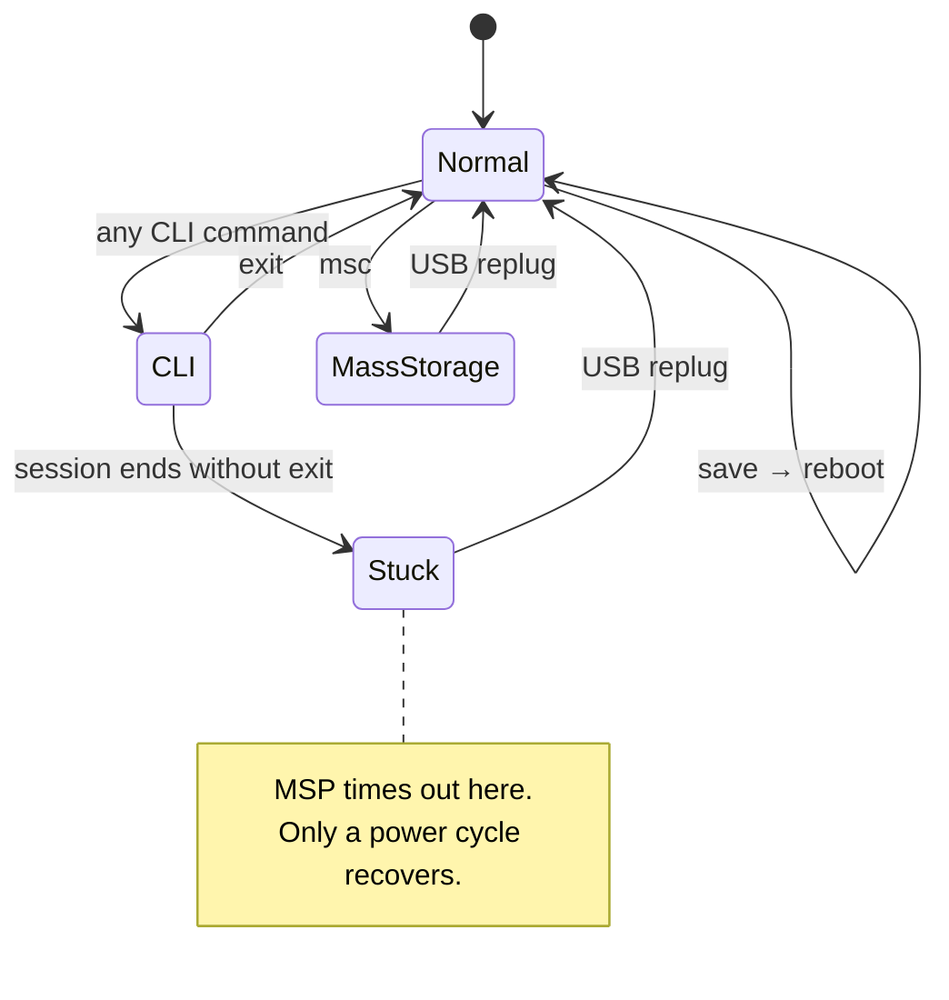

Three different problems all present as "the board stopped responding". They are
distinguishable by the exact error, and they have nothing to do with each other.

## Mode transitions

Understanding which mode the board is in explains all three:



## The three failure modes




**Symptom.** MSP requests time out, and any attempt to run a CLI command fails with:

```text
Error: CLI prompt not received within 5000ms. Buffer: "#"
```

Running `status` may also show `CLI` among the arming disable flags:

```text
Arming disable flags: RXLOSS CLI DSHOT_TELEM
```

**Cause.** The board entered CLI mode and never left. Betaflight only exits CLI on an
explicit `exit` or a reboot. While in CLI it does not speak MSP at all, so binary reads
time out. Worse, a tool trying to *enter* CLI sends `#` and waits for a fresh prompt — which
never comes, because the board is already at one. The stale `#` in the buffer is the
signature.

**Fix.** Unplug and replug the USB cable. Closing and reopening the serial port on the host
does **not** help — the state lives in the firmware, not the connection.

**Prevention.** End every CLI interaction with `exit` (or `save`, which reboots).



**Symptom.**

```text
Failed to connect: Error: No such file or directory, cannot open /dev/ttyACM1
```

**Cause.** The board re-enumerates on every replug and does not reliably get the same
device node. It alternates between `/dev/ttyACM0` and `/dev/ttyACM1` depending on what else
has claimed a node in the meantime.

**Fix.** Re-list the ports rather than reusing the previous path:

```bash
ls /dev/ttyACM*
```

The Betaflight device identifies itself, so a tool that enumerates properly will show it as
such along with its serial number.



**Symptom.**

```text
Failed to connect: Error: Device or resource busy, cannot open /dev/ttyACM1
```

**Cause.** Another process already holds the port open. The usual culprit is a browser tab
running the web Configurator, which keeps its Web Serial connection open until the tab is
closed.

**Fix.** Identify the holder and close it:

```bash
fuser /dev/ttyACM1
# or, with more detail:
lsof /dev/ttyACM1
```

```text
COMMAND     PID USER  FD   TYPE DEVICE SIZE/OFF NODE NAME
chrome  2845269 hans 232u   CHR  166,1      0t0 3953 /dev/ttyACM1
```

Close that tab or process and reconnect. `fuser` returning nothing means the port is free.




## Telling them apart quickly

| Error text | Mode | Fix |
| --- | --- | --- |
| `CLI prompt not received … Buffer: "#"` | Stuck in CLI | Replug USB |
| `No such file or directory` | Path moved | Re-enumerate `/dev/ttyACM*` |
| `Device or resource busy` | Port held | `fuser`, close the holder |
| MSP times out but CLI works fine | Not a fault | See [alpha firmware MSP](/docs/betaflight-mcp-claude-code/) |

That last row matters: on this build most MSP reads time out permanently by firmware
version, not by connection state, and no amount of replugging changes it.
